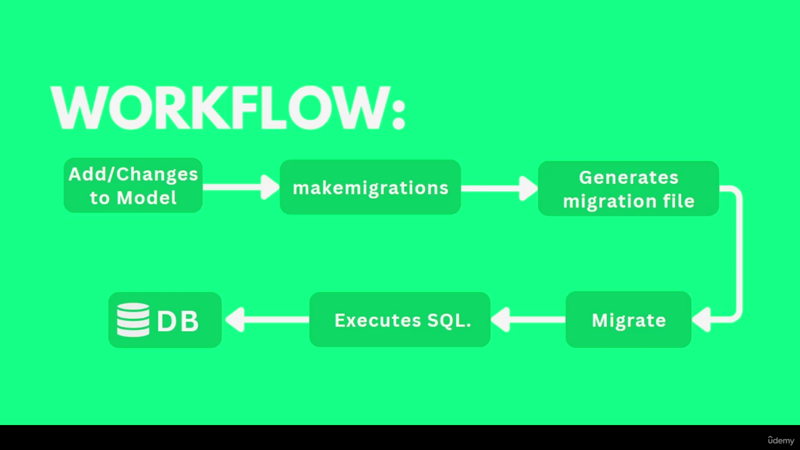

## Models and Database ([link](https://docs.djangoproject.com/en/5.1/topics/db/models/))

Django comes with Django-ORM that can handle any DataBase. 
Each model in django is just a table in database.




To work with Django-ORM, we need to create a `modles.py` file in each app, 
then follow model structure of django.

1. Create the model class in `models.py`
2. Register the app in installed-app `setting.py`
3. Make migrations and finally migrate by `manage.py`

```python
# app/models.py
from django.db import models
class Post(models.Model):
    name = models.CharField(max_length=100)
    price = models.FloatField()
    is_active = models.BooleanField()
```

### 1. [Model Field Types](https://docs.djangoproject.com/en/5.1/ref/models/fields/#model-field-types)

Django has multiple types of field for each type of data needed in a database.
But the most common cases are as follows:

| Field Type       | Description                    | Example Usage           |
|------------------|--------------------------------|-------------------------|
| `CharField`      | Short text (max_length needed) | Names, Titles           |
| `TextField`      | Long text                      | Descriptions, Comments  |
| `IntegerField`   | Integer numbers                | Age, Count, IDs         |
| `FloatField`     | Floating-point numbers         | Prices, Ratings         |
| `DecimalField`   | Decimal numbers                | Currency, Precise Values|
| `BooleanField`   | True/False values              | Status, Active flags    |
| `DateField`      | Date                           | Birthdays, Events       |
| `DateTimeField`  | Date & Time                    | Timestamps, Logs        |
| `EmailField`     | Email addresses                | User emails             |
| `URLField`       | URLs                           | Website links           |
| `FileField`      | File uploads                   | Images, Documents       |
| `ImageField`     | Image uploads                  | Profile pictures        |
| `ForeignKey`     | Many-to-One relation           | Author in Blog Posts    |
| `ManyToManyField`| Many-to-Many relation          | Tags, Categories        |
| `OneToOneField`  | One-to-One relation            | User Profile            |


### 2. [Field options](https://docs.djangoproject.com/en/5.1/ref/models/fields/#field-options)

Having the model field type, is it necessary to write option for each field.
Options can be different based on the type of field, but some of them are 
common like null, blank, default or unique

| Option        | Description |
|---------------|------------|
| `null`        | Allows `NULL` values in the database. (`null=True`) |
| `blank`       | Allows the field to be left empty in forms. (`blank=True`) |
| `default`     | Sets a default value for the field. (`default=42`) |
| `unique`      | Ensures unique values across records. (`unique=True`) |
| `choices`     | Restricts values to predefined choices. (`choices=[('A', 'Option A'), ('B', 'Option B')]`) |
| `max_length`  | Defines the maximum length of a string field. (`max_length=255`) |
| `help_text`   | Provides a description for the field in forms. (`help_text="Enter your name"`) |
| `verbose_name`| Custom human-readable name for the field. (`verbose_name="Full Name"`) |
| `db_index`    | Adds an index to the field in the database. (`db_index=True`) |
| `editable`    | Determines if the field is editable in the admin. (`editable=False`) |
| `primary_key` | Sets the field as the primary key. (`primary_key=True`) |
| `auto_now`    | Updates field to the current time on every save. (`auto_now=True`) |
| `auto_now_add`| Sets the field to the current time on creation. (`auto_now_add=True`) |


### 3. Make migrations and migrate
Each and every time we change the model class structure, 
we need to `make migrations` and then `migrate`
to make the database sync with the final update of the models.

```bash
    python manag.py makemigrations
    python manag.py showmigrations
    python manag.py migrate
```
This will create a file in `app/migrations` folder of app that utilize CreateModal to translate 
model to sql we set in `setting.py`

### 4. Working with DataBase & Create Method

#### 4-1. [Run commands from python-shell](https://docs.djangoproject.com/en/5.1/intro/tutorial02/#:~:text=Python%20shell%2C%20use%20this%20command%3A)

##### 4-1-1- [Save a record](https://docs.djangoproject.com/en/5.1/ref/models/instances/#django.db.models.Model.save)

To add data to the database, we can use both create() or save() method.

```python
# read all records from shell
    from post.models import Post
    posts = Post.objects.all()
    print(posts)

    
# create a record from shell
    from post.models import Post
    post = Post(title="What's new?", body="some text")
    post.save()

```

##### 4-1-2- [Create a record](https://docs.djangoproject.com/en/5.1/ref/models/instances/#django.db.models.Model.save)

Comon way to create new record is to call create method from the model itself

```python
# read
    post = Post.objects.get(pk=1)

#create
    Post.objects.create(title="The sky", body='some text')
```


### 5- [Query set](https://docs.djangoproject.com/en/5.1/ref/models/querysets/#)
QuerySet is an object that represents data in the database, but it is lazy, so it is not
calculated unless we literally ask for data.

There are many QuerySet methods in django for getting, deleting, and adding data to Database.
Most common query-sets are as follows

# Common Django QuerySet Methods

| Method               | Description | Example |
|----------------------|-------------|---------|
| `.all()`            | Returns all objects from the model. | `Post.objects.all()` |
| `.filter(**kwargs)` | Filters objects based on conditions. | `Post.objects.filter(title="Django Guide")` |
| `.exclude(**kwargs)`| Excludes objects matching conditions. | `Post.objects.exclude(title="Django Guide")` |
| `.get(**kwargs)`    | Returns a single object matching the condition. | `Post.objects.get(id=1)` |
| `.order_by(*fields)`| Orders results by given fields. | `Post.objects.order_by('-date')` |
| `.values(*fields)`  | Returns specific fields as dictionaries. | `Post.objects.values('id', 'title')` |
| `.values_list(*fields, flat=True)` | Returns specific fields as tuples or a flat list. | `Post.objects.values_list('title', flat=True)` |
| `.distinct()`       | Removes duplicate results. | `Post.objects.values('title').distinct()` |
| `.count()`          | Returns the number of objects. | `Post.objects.count()` |
| `.first()`          | Returns the first object. | `Post.objects.first()` |
| `.last()`           | Returns the last object. | `Post.objects.last()` |
| `.exists()`         | Checks if any object exists. | `Post.objects.filter(title="Django").exists()` |
| `.update(**kwargs)` | Updates matching records. | `Post.objects.filter(id=1).update(title="Updated Title")` |
| `.delete()`         | Deletes matching objects. | `Post.objects.filter(id=1).delete()` |
| `.create(**kwargs)` | Creates and saves a new object. | `Post.objects.create(title="New Post", body="Content")` |
| `.bulk_create([objects])` | Inserts multiple objects efficiently. | `Post.objects.bulk_create([Post(title="A"), Post(title="B")])` |
| `.annotate()`       | Adds computed fields. | `Post.objects.annotate(post_count=Count('id'))` |
| `.aggregate()`      | Computes summary values. | `Post.objects.aggregate(Avg('id'))` |
| `.select_related()` | Optimizes queries for ForeignKey relations. | `Post.objects.select_related('author').all()` |
| `.prefetch_related()` | Optimizes queries for ManyToMany relations. | `Post.objects.prefetch_related('tags').all()` |

---

### Example Usage:

```python
from myapp.models import Post

# Get all posts
posts = Post.objects.all()

# Get a specific post by ID
post = Post.objects.get(id=1)

# Get posts with "Django" in the title
django_posts = Post.objects.filter(title__icontains="Django")

# Order posts by date (descending)
latest_posts = Post.objects.order_by('-date')

# Check if any posts exist
has_posts = Post.objects.exists()

# Update a post's title
Post.objects.filter(id=1).update(title="Updated Title")

# Delete a post
Post.objects.filter(id=1).delete()


S05E10 just start