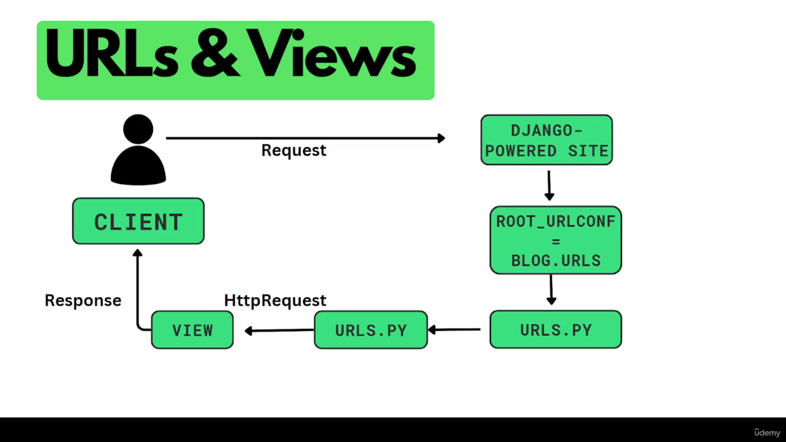

## URLs and Views 

Django routing follow setting in `setting.py` file and `ROOT_URLCONF = 'app.urls'`
where it is cleared where should django start from

### 1. FBV ([Function Base View](https://docs.djangoproject.com/en/5.1/ref/request-response/#httpresponse-objects))

#### 1-1- Return text as response

This type of view, run a function that triggers a HttpResponse (S03E02)



in `views.py` file
```
from django.http import HttpResponse

def index(request):
    return HttpResponse('Hello from Here')
   
   
def detail(request, question_id):
    return HttpResponse("You're looking at question %s." % question_id)
```


For route (`domain.com/home`) in `urls.py` file of the app folder
```
from django.urls import path
from . import views

urlpatterns = [
    path("home/", views.index),
]
```

in `urls.py` file in the main app folder for route (`domain.com/blog/home`)
```
from django.urls import path, include
urlpatterns = [
    path("/blog", include("blog.urls")),
]
```


#### 1-2- Return HTML as response

The easiest way is writing codes in `views.py` file. In the next step we can return a `render`

```
from django.http import HttpResponse

def index(request):
    return HttpResponse("<h1>Hello</h1>")
```

#### 1-3- Dynamic urls ([urls](https://docs.djangoproject.com/en/5.1/topics/http/urls/))

Some information is limitless, and it is not practical 
to define each of them statically in urls.

To have dynamic urls 
we can use `<var_name>` on each path in `urls.py` file, then get 
the parameter with same name in `views.py`.

We can set `path converter <int:id>` to get the data type we need ([link](https://docs.djangoproject.com/en/5.1/topics/http/urls/#path-converters))

```python
# urls.py
urlpatterns = [
    path("articles/2003/", views.special_case_2003),
    path("articles/<int:id>/", views.show_post)
]

# View (in blog/views.py)
def show_post(request, id):
    return HttpResponse(id)
```

#### 1-4- HttpResponse Subclass ([link](https://docs.djangoproject.com/en/5.1/ref/request-response/#httpresponse-subclasses))

In django.http domain, besides HttpResponse, we have many methods and class, namely as follows:

```
    HttpResponsePermanentRedirect 303
    HttpResponseNotModified
    HttpResponseBadRequest 404
    HttpResponseNotFound 404
    HttpResponseNotAllowed 401
```


#### 1-5- Name the urls and reverse ([link](https://docs.djangoproject.com/en/5.1/ref/urlresolvers/#django.urls.reverse))

Each url can have a unique name to be called back by `reverse()` in `views()`

```
# url.py
    path("home/", views.home, name="home_page")

# using the named URL
    reverse("home_page")

# views.py
    from django.urls import reverse
    def myview(request):
        return HttpResponseRedirect(reverse("show_post", args=[3], kwargs={"id": 3}))
```

#### 1-6- Customized 404 page (S04E17) ([link](https://docs.djangoproject.com/en/5.1/topics/http/views/#django.http.Http404))

In case 404 occurred, we need to send the feedback in HTML format with the same `base.html` template. 
We need to create a file with `templates/404.html` file name in root directory.
Then, like other templates, extend from basic.html and follow suit.
Finally, set `raise Http404()` error in case no data founded.

```django
def index(request, id):
    try:
        data = Post.objects.get(pk=id)
    except Post.DoesNotExist:
        raise Http404()
```